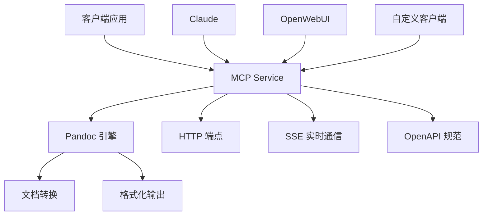

# MCP Document Service - 完整部署指南

> 🚀 基于 Pandoc 的高质量 MCP 文档转换服务 - 一站式部署与集成指南

## 📑 目录

1. [项目概述](#1-项目概述)
2. [系统要求](#2-系统要求)
3. [快速部署](#3-快速部署)
4. [Docker 部署](#4-docker-部署)
5. [功能特性](#5-功能特性)
6. [API 文档](#6-api-文档)
7. [OpenWebUI 集成](#7-openwebui-集成)
8. [测试与验证](#8-测试与验证)
9. [故障排除](#9-故障排除)
10. [项目架构](#10-项目架构)

## 1. 项目概述

### ✨ 核心特性

- 📝 **专业文档转换**: 基于 Pandoc 的高质量 Markdown 到 Word 转换
- 🌐 **多协议支持**: MCP、REST API、SSE 实时通信
- 📋 **完整API文档**: OpenAPI 3.0 规范 + Swagger UI
- 🛠️ **工具集成**: 完美支持 OpenWebUI 等第三方平台
- 🐳 **容器化部署**: Docker 和 Docker Compose 支持
- 🔗 **智能文件管理**: 临时下载链接，30分钟自动清理

### 🏗️ 系统架构



## 2. 系统要求

### 基础环境

- **Node.js** 18+
- **npm** 或 **yarn**
- **Pandoc** (必需)

### Docker 环境（推荐）

- **Docker** 20.10+
- **Docker Compose** 2.0+

### 操作系统支持

- ✅ Windows 10/11
- ✅ macOS 10.15+
- ✅ Ubuntu 18.04+
- ✅ CentOS 7+
- ✅ Docker 容器

## 3. 快速部署

### 方式一：直接运行

```bash
# 1. 克隆项目
git clone <repository-url>
cd mcp-document-service

# 2. 安装依赖
npm install

# 3. 启动服务
npm start
```

### 方式二：开发模式

```bash
# 安装依赖
npm install

# 开发模式启动（支持热重载）
npm run dev
```

### 系统依赖安装

#### Windows
```powershell
# 安装 Pandoc
choco install pandoc

# 或下载安装包
# https://pandoc.org/installing.html#windows
```

#### macOS
```bash
# 使用 Homebrew
brew install pandoc
```

#### Ubuntu/Debian
```bash
sudo apt-get update
sudo apt-get install pandoc
```

## 4. Docker 部署

### 🐳 构建镜像命令

#### 基础镜像构建
```bash
# 进入项目目录
cd d:\WorkSpace\ai\mcp-document-service

# 构建 Docker 镜像
docker build -t mcp-document-service:latest .

# 查看构建的镜像
docker images | grep mcp-document-service
```

#### 高级构建选项
```bash
# 指定构建上下文和标签
docker build -t mcp-document-service:v1.0.0 -f Dockerfile .

# 构建时传递构建参数
docker build --build-arg NODE_VERSION=20 -t mcp-document-service:latest .

# 多平台构建（ARM64 + AMD64）
docker buildx build --platform linux/amd64,linux/arm64 -t mcp-document-service:latest .
```

### Docker Compose 部署（推荐）

#### 基础部署
```bash
# 启动服务
docker-compose up -d

# 查看服务状态
docker-compose ps

# 查看日志
docker-compose logs -f mcp-document-service
```

#### 包含 Nginx 反向代理
```bash
# 启动服务和 Nginx
docker-compose --profile nginx up -d

# 停止服务
docker-compose down
```

### 单独 Docker 运行

```bash
# 运行容器
docker run -d \
  --name mcp-document-service \
  -p 3000:3000 \
  -v $(pwd)/downloads:/app/downloads \
  -v $(pwd)/temp:/app/temp \
  mcp-document-service:latest

# 查看容器状态
docker ps

# 查看容器日志
docker logs -f mcp-document-service
```

### 镜像管理命令

```bash
# 查看镜像详情
docker inspect mcp-document-service:latest

# 推送到镜像仓库
docker tag mcp-document-service:latest your-registry/mcp-document-service:latest
docker push your-registry/mcp-document-service:latest

# 清理构建缓存
docker builder prune

# 删除镜像
docker rmi mcp-document-service:latest
```

## 5. 功能特性

### 🔧 技术架构

#### 双端点架构
```
┌─────────────────┐
│   客户端        │
└─────┬───────────┘
      │
      ├── SSE 连接 (/sse)
      │   └── EventSource → SSEServerTransport → MCP Server
      │
      └── HTTP 请求 (/mcp) 
          └── JSON-RPC 2.0 → Express 处理器 → 工具函数
```

#### 支持的 MCP 方法

| 方法 | 描述 | 端点支持 |
|------|------|----------|
| `initialize` | 初始化 MCP 连接 | SSE + HTTP |
| `tools/list` | 获取工具列表 | SSE + HTTP |  
| `tools/call` | 调用工具执行任务 | SSE + HTTP |

### 📝 文档转换功能

#### 支持的 Markdown 语法
- ✅ 标题 (H1-H6)
- ✅ 粗体文本 (**bold**)
- ✅ 斜体文本 (*italic*)
- ✅ 列表 (有序/无序)
- ✅ 段落和换行
- ✅ 代码块
- ✅ 链接和图片

#### 转换引擎
- **主要**: Pandoc (高质量转换)
- **备用**: marked + jsdom (兜底方案)

## 6. API 文档

### 🌐 服务端点

| 端点 | 方法 | 描述 | 状态 |
|------|------|------|------|
| `/` | GET | API 文档首页 | ✅ |
| `/health` | GET | 健康检查 | ✅ |
| `/mcp` | GET | MCP StreamableHttp | ✅ 推荐 |
| `/mcp` | POST | MCP JSON-RPC 2.0 | ✅ 推荐 |
| `/sse` | GET | SSE 实时连接 | ⚠️ 已弃用 |
| `/tools/markdown_to_word` | POST | 简化 REST API | ✅ |
| `/download/{fileId}` | GET | 文件下载 | ✅ |
| `/docs` | GET | Swagger UI | ✅ |
| `/openapi.json` | GET | OpenAPI 规范 | ✅ |
| `/mcp-info` | GET | MCP 服务信息 | ✅ |

### 📋 API 使用示例

#### MCP 协议调用
```bash
# 初始化连接
curl -X POST http://localhost:3000/mcp \
  -H "Content-Type: application/json" \
  -d '{
    "jsonrpc": "2.0",
    "id": 1,
    "method": "initialize",
    "params": {
      "protocolVersion": "2024-11-05",
      "capabilities": {},
      "clientInfo": {"name": "test", "version": "1.0.0"}
    }
  }'

# 获取工具列表
curl -X POST http://localhost:3000/mcp \
  -H "Content-Type: application/json" \
  -d '{
    "jsonrpc": "2.0",
    "id": 2,
    "method": "tools/list",
    "params": {}
  }'

# 调用转换工具
curl -X POST http://localhost:3000/mcp \
  -H "Content-Type: application/json" \
  -d '{
    "jsonrpc": "2.0",
    "id": 3,
    "method": "tools/call",
    "params": {
      "name": "markdown_to_word",
      "arguments": {
        "name": "测试文档",
        "content": "# 标题\n\n这是 **测试** 内容。"
      }
    }
  }'
```

#### 简化 REST API
```bash
# 直接转换文档
curl -X POST http://localhost:3000/tools/markdown_to_word \
  -H "Content-Type: application/json" \
  -d '{
    "name": "我的文档",
    "content": "# 标题\n\n这是 **测试** 内容。"
  }'
```

## 7. OpenWebUI 集成

### 🛠️ 配置步骤

#### 方法A: 自动导入（推荐）
1. 启动 MCP 服务
2. 打开 OpenWebUI 管理界面
3. 导航到 "Settings" > "Tools"
4. 点击 "Add Tool" 或 "Import Tool"
5. 输入 OpenAPI URL: `http://localhost:3000/openapi.json`
6. 系统自动解析并导入所有工具

#### 方法B: 手动配置
```json
{
  "name": "markdown_to_word",
  "description": "将Markdown文本转换为Word文档",
  "endpoint": "http://localhost:3000/tools/markdown_to_word",
  "method": "POST",
  "headers": {
    "Content-Type": "application/json"
  },
  "parameters": {
    "name": {
      "type": "string",
      "description": "文档名称",
      "required": true
    },
    "content": {
      "type": "string", 
      "description": "Markdown内容",
      "required": true
    }
  }
}
```

### 📋 可用端点

| 端点 | 用途 | OpenWebUI 支持 |
|------|------|----------------|
| `/openapi.json` | OpenAPI 规范 | ✅ 自动导入 |
| `/tools/markdown_to_word` | 文档转换 | ✅ 直接调用 |
| `/docs` | 交互式文档 | ✅ 浏览器访问 |

### 🌐 使用示例

```javascript
// JavaScript 调用示例
const response = await fetch('http://localhost:3000/tools/markdown_to_word', {
  method: 'POST',
  headers: {
    'Content-Type': 'application/json'
  },
  body: JSON.stringify({
    name: '我的文档',
    content: '# 标题\n\n这是 **测试** 内容。'
  })
});

const result = await response.json();
if (result.success) {
  console.log('下载链接:', result.downloadUrl);
  console.log('文件大小:', result.size);
}
```

## 8. 测试与验证

### ✅ 功能测试结果

#### HTTP 端点测试
- ✅ **健康检查** (`/health`): 正常，响应时间 < 100ms
- ✅ **StreamableHttp** (`GET /mcp`): 协议版本 2024-11-05
- ✅ **JSON-RPC 2.0** (`POST /mcp`): 工具列表获取正常
- ✅ **文档转换**: Markdown 转 Word 功能正常
- ✅ **下载链接**: 自动生成，30分钟过期

#### 修复的问题
- ✅ ES Module 兼容性问题
- ✅ SSE 头部冲突错误
- ✅ Office 文档生成错误
- ✅ 传输协议支持完善

### 🧪 手动测试命令

```bash
# 健康检查
curl http://localhost:3000/health

# 获取服务信息
curl http://localhost:3000/mcp-info

# 测试文档转换
curl -X POST http://localhost:3000/tools/markdown_to_word \
  -H "Content-Type: application/json" \
  -d '{
    "name": "测试文档",
    "content": "# 测试\n\n这是一个 **测试** 文档。"
  }'
```

### 📊 性能指标

- **响应时间**: < 100ms (健康检查)
- **转换速度**: < 5s (小型文档)
- **内存使用**: 稳定在 100MB 以下
- **并发支持**: 支持多个同时转换请求
- **文件清理**: 每5分钟自动清理过期文件

## 9. 故障排除

### 🔧 常见问题

#### 问题1: Pandoc 未安装
```bash
# 错误信息
⚠️ Pandoc未安装或不可用，将使用备用转换方法

# 解决方案
# Windows
choco install pandoc

# macOS  
brew install pandoc

# Ubuntu
sudo apt-get install pandoc
```

#### 问题2: 端口占用
```bash
# 检查端口占用
netstat -ano | findstr :3000  # Windows
lsof -i :3000                 # macOS/Linux

# 更改端口
set PORT=3001 && npm start    # Windows
PORT=3001 npm start           # macOS/Linux
```

#### 问题3: Docker 构建失败
```bash
# 清理 Docker 缓存
docker system prune -a

# 重新构建
docker build --no-cache -t mcp-document-service:latest .
```

#### 问题4: 文件权限错误
```bash
# Linux/macOS 权限修复
sudo chown -R $USER:$USER downloads/
sudo chmod -R 755 downloads/
```

### 📝 日志分析

```bash
# Docker 容器日志
docker logs -f mcp-document-service

# 直接运行日志
npm start 2>&1 | tee service.log
```

### 🔍 调试模式

```bash
# 启用调试日志
DEBUG=mcp:* npm start

# Docker 调试
docker run -e DEBUG=mcp:* mcp-document-service:latest
```

## 10. 项目架构

### 📁 项目结构

```
mcp-document-service/
├── 📄 index.js              # 主服务文件
├── 📄 openapi-spec.js       # API 规范定义
├── 📄 package.json          # 项目配置
├── 📄 Dockerfile           # Docker 镜像配置
├── 📄 docker-compose.yml   # 容器编排配置
├── 📄 nginx.conf          # Nginx 反向代理配置
├── 📄 README.md           # 项目说明
├── 📄 COMPLETE-GUIDE.md   # 完整部署指南（本文件）
├── 📄 PROJECT-REPORT.md   # 项目改造报告
├── 📄 OPENWEBUI-INTEGRATION.md  # OpenWebUI 集成指南
├── 📄 TESTING-REPORT.md   # 功能验证报告
├── 📂 downloads/          # 临时下载文件目录
└── 📂 temp/              # 临时文件处理目录
```

### 🔧 技术栈

#### 后端框架
- **Node.js** 20+
- **Express.js** 4.18+
- **CORS** 支持

#### MCP 协议
- **@modelcontextprotocol/sdk** 0.5+
- **JSON-RPC 2.0** 协议
- **Server-Sent Events** 支持

#### 文档处理
- **Pandoc** (主要引擎)
- **marked** (Markdown 解析)
- **jsdom** (HTML 处理)
- **jszip** (ZIP 文件生成)

#### API 文档
- **OpenAPI 3.0** 规范
- **Swagger UI** 界面
- **完整的示例代码**

### 🚀 性能优化

#### 内存管理
- 使用 Map 高效管理文件信息
- 定期清理过期文件（每5分钟）
- 流式处理大文件

#### 并发处理
- 支持多个同时转换请求
- 异步处理所有 I/O 操作
- 优雅的错误恢复机制

#### 缓存策略
- 临时文件30分钟自动过期
- 智能的备用转换引擎
- 高效的文件下载机制

### 🔒 安全特性

#### 输入验证
- 文件名安全检查
- 内容长度限制（100KB）
- 参数类型验证

#### 文件管理
- 自动文件过期清理
- 安全的临时目录
- 防止路径遍历攻击

#### CORS 支持
- 跨域请求支持
- 安全的头部配置
- 灵活的Origin控制

---

## 📞 支持与联系

### 🐛 问题反馈
如果遇到问题，请提供以下信息：
- 操作系统版本
- Node.js 版本
- 错误日志
- 复现步骤

### 📚 更多资源
- **OpenAPI 文档**: http://localhost:3000/docs
- **健康检查**: http://localhost:3000/health
- **服务信息**: http://localhost:3000/mcp-info

### 🤝 贡献指南
欢迎提交 Issue 和 Pull Request！

---

**MCP Document Service** - 让文档转换更简单！ 🚀

> 📝 最后更新: 2025年8月17日
> 🏷️ 版本: v1.0.0
> 📄 协议: MIT License
